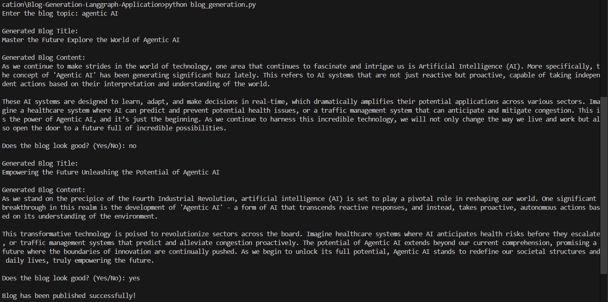
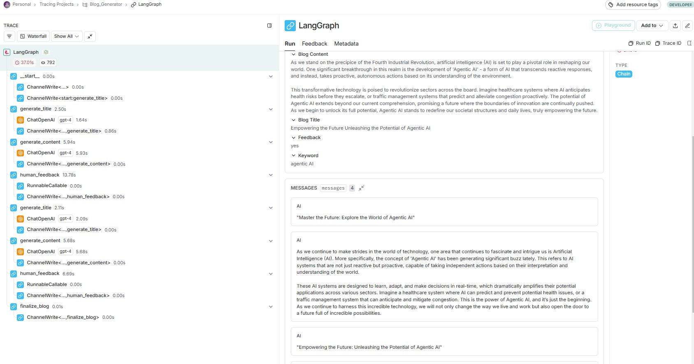

## Blog-Generation-Langgraph-Application

🚀 Blog Generation using LangGraph & Open Source LLMs
This project provides an end-to-end automated blog generation application using LangGraph and open-source Large Language Models (LLMs). The workflow is built using LangChain, allowing efficient blog content generation and debugging with LangSmith.

🔹 Features
✅ Automates blog title and content generation using open-source LLMs
✅ Implements a workflow-based structure using LangGraph
✅ Supports human feedback integration for regenerating content
✅ Debuggable in LangSmith, ensuring full traceability
✅ Easy-to-use command-line interface

📌 How It Works
1️⃣ The user enters a topic for the blog.
2️⃣ The system generates a title automatically.
3️⃣ Based on the title, 1-2 paragraph blog content is generated.
4️⃣ The user reviews the content and provides feedback:

✅ Yes → Blog is finalized & saved
❌ No → The system regenerates title & content
5️⃣ The workflow runs in LangGraph, and debugging is enabled via LangSmith.

#### Terminal output

#### Langsmith workflow

